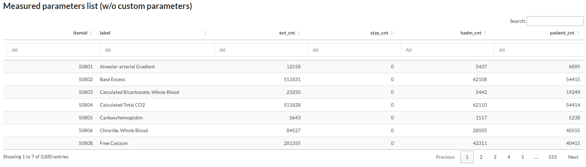

Navigate througth the database
##############################

MIMICWizard is now installed and you're ready for a walkthrought let's discover the application features.

Explore the data
****************

The first tab is used to explore the list of all recorded events in MIMIC-IV database associated with their relative count.

.. _parameters_explore:

      Screenshot from first page of the parameters list, user can search by label and order by event count 

You can search any event in the database and see if it's efficiently populated in MIMIC or at least find a proxy that could meet your needs (:numref:`parameters_explore`)

In fact a lots of events/patient data are redundant or splitted in several item and that's the main purpose of this first tab, see how the data is divided in the database.

Discover a patient card
***********************

Create a retrospective cohort from MIMIC patients
*************************************************

Explore a created cohort
************************

Define your profile to navigate faster
**************************************