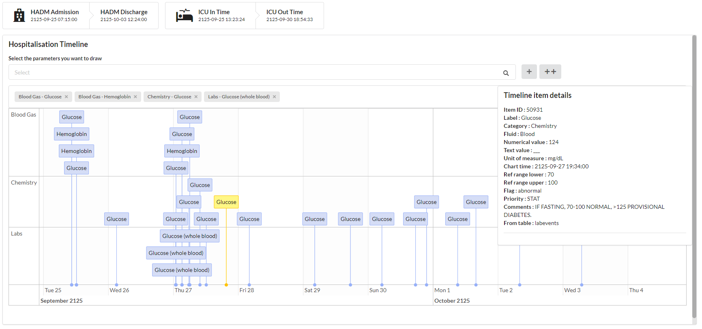
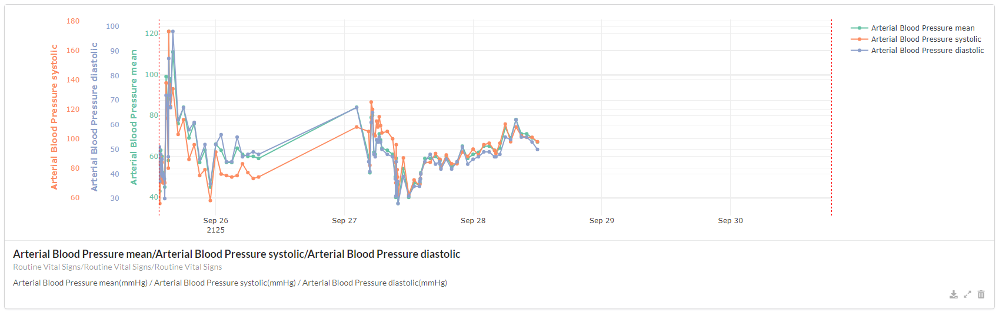

Navigate througth the database
##############################

MIMICWizard is now installed and you're ready for a walkthrought let's discover the application features.

Explore the data (Parameter Exploration)
****************************************

The first tab is used to explore the list of all recorded events in MIMIC-IV database associated with their relative count.

.. _parameters_explore:
.. figure:: assets/parameters_explore.png
      :width: 100%
      :class: no-scaled-link

      First page of the parameters list, user can search by label and order by event count 

You can search any event in the database and see if it's efficiently populated in MIMIC or at least find a proxy that could meet your needs (:numref:`parameters_explore`). In fact a lots of events/patient data are redundant or splitted in several item and that's the main purpose of this first tab, see how the data is divided in the database.

Discover a patient card (Patient Explorer)
******************************************
Here you can browse all the patient in the database and display all events registered during his hospitalization.

You can choose to select a patient using the classic subject_id > hadm_id > stay_id path to access patient data or directly access a patient stay using the **Direct search with a UID** feature, 
enabling easy reference sharing between user without transmitting a 3 value key to access a patient stay.

Timeline module
+++++++++++++++

.. _parameters_explore:

      Hospitalization timeline of a patient, displaying glucose and hemoglobin. A glucose measurement is selected and detailled information are shown on the right side.

The timeline is used to represent complex event such as free-text event, event represented as a character or a factor or to go deeper in the data.
It allows an almost complete access to the database row behind this event. 

To add an event type in the database, search this event in the bar just above the timeline and click on ``+``. If you cannot find an event on this searchbar, it means that the selected patient haven't any event of this type referenced for the selected hadm/stay.

If a lots of data is stacked at the same time point, it can be summarized by their category name. Then you have to select the item to observe all linked events.

Graph module
++++++++++++

.. _parameters_explore:

.. tip:: You can use the ``++`` button to add an event both in the timeline and in the graph module

Create a retrospective cohort from MIMIC patients
*************************************************

Explore a created cohort
************************

Define your profile to navigate faster
**************************************