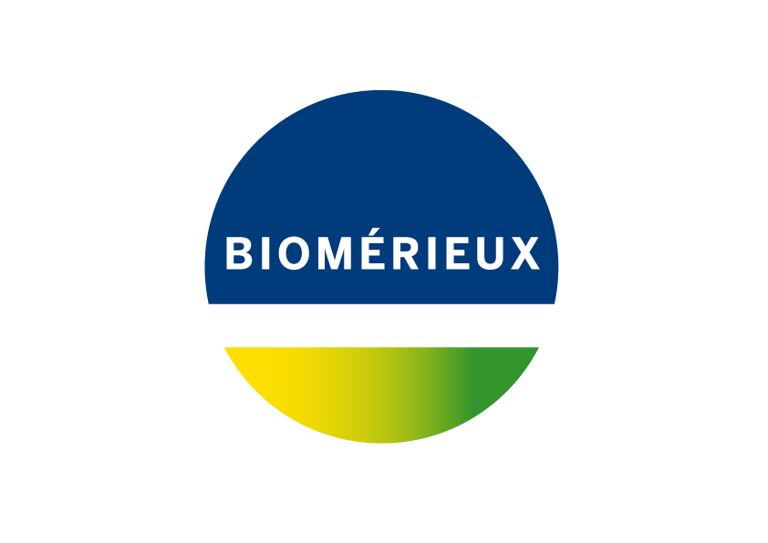

MIMICWizard Documentation
########################

**MIMICWizard** is a Shiny app allowing user to navigate throught the PhysioNet MIMIC-IV database, a freely accessible deidentified electronic health record (EHR) dataset

Introduction
**************

The advent of Open-Access Electronic Health Records (EHRs) has revolutionized the landscape of clinical diagnosis and research. These digital versions of patient charts provide real-time, patient-centred records that provide precious information about patient state during its hospital stay.
However, the full potential of EHRs is yet to be realized due to two major constraints. 
First, access to patient databases is often restricted, limiting the scope of research and analysis. Second, there exists a significant technical barrier for non-technical users who wish to explore these databases but lack the necessary data science skills. 

In this context, we introduce MIMIC Wizard, an application designed to bridge this second gap to highlight new data usage and exploration for non-technical user. Developed to interact with the version 2.2 (01/2023) of  MIMIC-IV medical database provided by MIT, MIMIC Wizard allows users to navigate through the database without the need for extensive data science knowledge.
Initially designed for physician, it offer a tool to help drawing and exploring new hypothesis. 

Getting started
**************

Navigate through the app 
**************

Extended usage with data-science knowledge
**************

Changelog
**************

Research and development team
============================

This application was originally developed by the Common Research Laboratory of Edouard Herriot Hospital (Laboratoire Commun de Recherche - HCL-bioMérieux, Lyon, France).

.. image:: ../assets/LogoHCL.jpg
   :height: 100px
   :alt: Hospices Civils de Lyon logo
   :align: center

The app is provided under open-source GNU GPLv3 licence. All contributions and suggestions are welcome. Learn more about contribution in our dedicated page How to contribute
*Read about the MIMICWizard research paper*

.. note::

   This project is under active development.

References and data
**************

**Read about MIMIC-IV database and Physionet repository**
